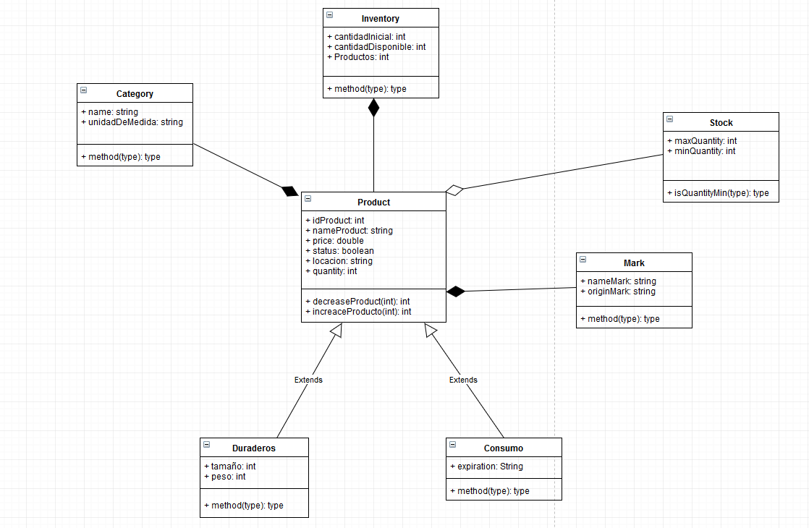

# CONTROL DE INVENTARIOS
## Introducción
El inventario tiene como propósito fundamental, proveer a la empresa de materiales necesarios, para su continuo y 
regular desenvolvimiento, es decir, el inventario tiene un papel vital para el funcionamiento acorde y coherente dentro 
del proceso de producción y de esta forma afrontar la demanda. Así también el inventario refleja la existencia física de
la mercancía, materia prima, productos semiterminados o terminados que tiene una empresa en un lugar y fecha determinada.
El objetivo del control de  inventarios es el de maximizar la respuesta y reducir los costos.
Existen dos sistemas de control de inventarios:
- Sistema de inventarios perpetuo o continuo.
- Sistema de inventarios periódico. 

## Objetivo General
Control continuo de cada artículo del inventario, para que los registros muestran las mercancías o materia prima 
disponibles en todo momento (saldos y existencia correspondiente). sin la necesidad de realizar un inventario físico. 
y así maximizar la respuesta a la demanda y reducir los costos de almacenamiento.

## Objetivos específicos
- Almacenar nombre del producto, precio, ubicación, estado y categoría
- Control de cantidad maxima y minima.
- Control de existencia del producto
- Control de ingresos y salidas

## Diagrama de clases

